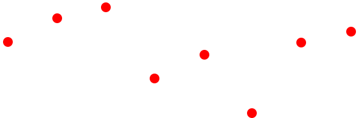
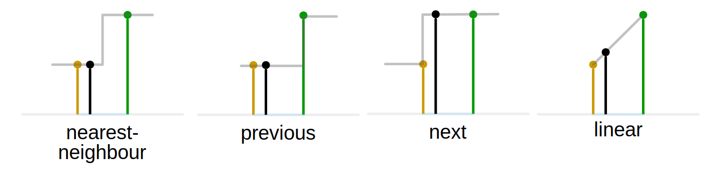
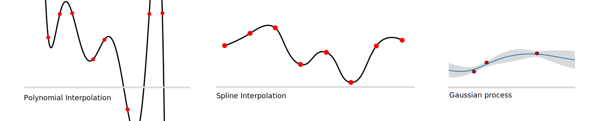

# Interpolation

## Motivation

Interpolation (Latin for *inter* = between and *polire* = smoothing) is an essential technique for processing numerical data in the engineering domain. 
Sensor output recorded over time as time-series usually requires interpolation to reduce the data amount 
or as a first step to combine with other data sources.

Mathematically, given a list of \\(N\\) pairs \\( (x_i, f_i) \ \forall i \in 0 \dots N-1 \\) (often generated by an unknown function or process \\(f(x)\\)), 
we are interested in the intermediate values (i..e \\( x_* \\)) which are not equal to any of \\( x_i \\). Those values are often referred as *query* points.
Usually, the list is sorted by \\( x \\) in ascending manner.

<figcaption>

**Figure 1**: Interpolation problem visualized.

</figcaption>

In case we are interested in values of \\( x < x_0 \\) or \\( x > x_{N-1} \\) we talk about *extrapolation*.

Note, that the argument \\( x \\) can also be time \\( t \\), in that case we speak about temporal interpolation. Additionally, in this overview we mainly look at the one-dimensional (1D) case, more details on more dimensions can be found in the section below.

There are multiple approaches to interpolate between known data points, which will be categorized and explained in the following sections.

## Methods

Across next section, we will introduce three approach families, the first two are separated by the number of points they use for the approximation of intermediate values. 
The first category are the *proximity-based* methods, which take one or two sample points into account. 
The second category take more then two points into account and will be called *global*, because they also consider values outside the close proximity.
The third family is called *application-specific*, since some applications require a special consideration when dealing with intermediate values.

### Proximity-based

The proximity can be defined based on the numerical distance to the sample points (nearest-neighbour), or based on the position wrt to sample points.
The algorithms in the proximity based method family select the value of the nearest point and does not consider the values of neighbouring points at all

<figcaption>

**Figure 2**: Proximity based interpolation methods. Altered version of [^interpolation_methods_image] 

</figcaption>

#### Nearest-Neighbour

Yielding a piecewise-constant interpolant around a single point. The algorithm is very simple to implement and is commonly used. (https://en.wikipedia.org/wiki/Nearest-neighbor_interpolation)

#### Previous/Next

In some applications however, especially those dealing with time-series, taking the nearest sample means taking values in the future, which is not always suited. Therefore variation forward-fill ``ffill` exist, where \\( f_i \\) is true for all \\( x \in [x_i, x_{i+1}[ \\). 

The opposite, backward-fill, where \\( f_{i+1} \\) is true for all \\( x \in [x_i, x_{i+1}[ \\) is often used for XYZ.

#### Linear

Linear interpolation assumes a linear relationship between two sample points, i.e.

\\[
f(x) = ax +b = \frac{f_{i+1}- f_{i}}{x_{i+1}- xf_{i}} + f_{i} \ \forall x \in [x_i, x_{i+1}[
\\]

### Global

Global methods take into account more than two points around the query location \\( x_* \\). Some methods even take into account all available points.

<figcaption>

**Figure 3**: Global interpolation methods. Images taken from Wikipedia.

</figcaption>

#### Polynomial

A \\(n\\)-degree polynomial \\( p(x) = c_n x^n + c_{n-1} x^{n-1} + \dots + c_0 \\) is fitted to multiple points around the query \\( x_* \\). Mathematically, we can use regression techniques to find the coefficients \\( c_j \\) or compute an exact solution taking \\( n+1 \\) points.

#### Spline

Similar to linear interpolation which uses a linear function for each of intervals \\( [x_i, x_{i+1}] \\), spline interpolation uses low-degree polynomials in each of the intervals, and chooses the polynomial pieces such that they fit smoothly together. The resulting function is called a spline.

The *fitting smoothly* requirement is ensured via mathematical constrains to the derivatives, such as \\( p_i'(x_i) = p_{i+1}'(x_i) \land p_i''(x_i) = p_{i+1}''(x_i)  \\) [^spline]

This property can be helpful when interpolating physical quantities, where changes happen smoothly.

#### Regression

Instead of taking a \\(n\\)-degree polynomial, we could potentially use any parametrical function and fit the data to it. One interesting method is the *Gaussian-Process* Regression, an machine learning, where in addition to the interpolated function value \\(f_*\\) the uncertainty estimate is computed.

#### Aggregation

For cases where the array of query points \\( x_* \\) have lower temporal frequency than the sample points,
i.e. between each query point there are multiple sample points, statistical metrics such as arithmetic mean, median or \\(p\\)-percentile can be computed.

The following equation computes the average aggregation for query points \\( x_* \\) with a sampling distance \\( S \\) between each other.

\\[
f_* = avg( x_* ) = \frac 1 N \sum_{x_i \in [x_* - \frac{s}{2}, x_* + \frac{s}{2}]} f_i
\\]

The aggregation takes all sample points which fall in the interval \\( \pm S \\) and takes the average of the function values.

This interpolation technique can have multiple purposes: mean or median can be used for summarizing noisy measurements in timeseries data. Aggregations such as *min*, *max* or *percentile* allow emphasizing on critical values, such as potholes while sampling the road surface.

### Application-specific

For some applications assuming a polynomial or linear function is not enough. For physical systems and noisy data, *Kalman Filter*[^kalman_filter] can be used for estimating intermediate values. To apply the Kalman filter, we need a mathematical state-space equation system describing the physics behind the temporal dynamics and the relationship to the measurement. This methodology is also called *Kalman Smoothing*[^kalman_smoothing].

An alternative, statistical, method is to use Gaussian Process Regression. In addition to the function value \\( f_* \\) we can compute an uncertainty estimate \\( \sigma_* \\).

When dealing with transformations between coordinate systems, represented as quaternion, a method called *SLERP* is used, assuming rotation with uniform angular velocity around a fixed rotation axis.[^slerp]

## Implementation

A majority of mentioned neighborhood- and global methods are implemented within the `pandas.DataFrame.resample` functionality.
See [here](https://pandas.pydata.org/docs/reference/resampling.html#upsampling) for an overview of available methods.

For some of the methods, such as splines or polynomial interpolation, pandas falls back to `scipy`'s `interpolate` functionality.
One of them is `scipy.interpolate.interp1d` ([source](https://docs.scipy.org/doc/scipy/reference/generated/scipy.interpolate.interp1d.html)).

## Dimensionality

WIP

## References

[^interpolation_methods_image] By Cmglee - Own work, CC BY-SA 4.0, [link](https://commons.wikimedia.org/w/index.php?curid=53064904)

[^spline] [Wikipedia: Spline Interpolation](https://en.wikipedia.org/wiki/Spline_interpolation#Introduction)

[^kalman_filter] [Wikipedia: Kalman Filter](https://en.wikipedia.org/wiki/Kalman_filter)

[^kalman_smoothing] [Wikipedia: Kalman Filter - Fixed-lag smoother](https://en.wikipedia.org/wiki/Kalman_filter#Fixed-lag_smoother)

[^slerp] [Wikipedia: Quaternion Slerp](https://en.wikipedia.org/wiki/Slerp#Quaternion_Slerp)