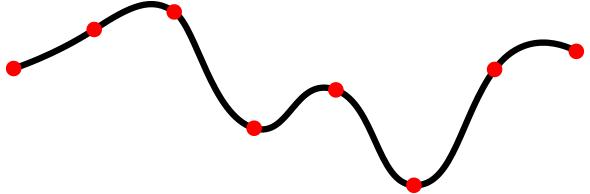

# Interpolation

Interpolation (Latin for *inter* = between and *polire* = smoothing) is an essential technique for processing numerical data in the engineering domain. 
Sensor output recorded over time as time-series usually requires interpolation to reduce the data amount 
or as a first step to combine with other data sources.

Mathematically, given a list of $N$ pairs \\( (x_i, f_i) \ \forall i \in 0 \dots N-1 \\), often generated by an unknown function or process \\(f(x)\\), 
we are interested in the intermediate values of \\( x \\) which are not equal to any of \\( x_i \\). 
Usually, the list is sorted by \\( x_i \\). In case we are interested in values of \\( x < x_0 \\) or \\( x > x_{N-1} \\) we talk about *extrapolation*.

Note, that the argument \\( x \\) can also be time \\( t \\), in that case we speak about temporal interpolation. Additionally, in this overview we mainly look at the one-dimensional (1D) case, more details on more dimensions can be found in the section below.

There are multiple approaches to interpolate between known data points, which will be listed in the following sections.

## Methods

Across next section, we will introduce three approach families, the first two are separated by the number of points they use for the approximation of intermediate values. The third family is called application-specific, since some applications require a special consideration when dealing with intermediate values.

The first category are the *proximity-based* methods, which take one or two sample points into account. The second category take more then two points into account and will be called *global*, because they also consider values outside the close proximity.

### Proximity-based

The proximity can be defined based on the numerical distance to the sample points (nearest-neighbor), or based on the position wrt to sample points.
The algorithms in the proximity based method family select the value of the nearest point and does not consider the values of neighboring points at all, 

#### Nearest-Neighbour

Yielding a piecewise-constant interpolant around a single point. The algorithm is very simple to implement and is commonly used. (https://en.wikipedia.org/wiki/Nearest-neighbor_interpolation)

#### Previous/Next

In some applications however, especially those dealing with time-series, taking the nearest sample means taking values in the future, which is not always suited. Therefore variation forward-fill ``ffill` exist, where \\( f_i \\) is true for all \\( x \in [x_i, x_{i+1}[ \\). 

The opposite, backward-fill, where \\( f_{i+1} \\) is true for all \\( x \in [x_i, x_{i+1}[ \\) is often used for XYZ.

#### Linear

Linear interpolation assumes a linear relationship between two sample points, i.e.

\\[
f(x) = ax +b = \frac{f_{i+1}- f_{i}}{x_{i+1}- xf_{i}} + f_{i} \ \forall x \in [x_i, x_{i+1}[
\\]

### Global

Global methods take into account more than two points around the value of interest \\( x_* \\). Some methods even take into account all available points.

#### Polynomial

A \\(n\\)-degree polynomial \\( p(x) = c_n x^n + c_{n-1} x^{n-1} + \dots + c_0 \\) is fitted to multiple points around  \\( x_* \\). Mathematically, we can use regression techniques to find the coefficients \\( c_j \\) or compute an exact solution taking \\( n+1 \\) points.

### Regression

Instead of taking a \\(n\\)-degree polynomial, we could potentially use any parametrical function and fit the data to it. One interesting method is the Gaussian-Process Regression, an machine learning, where in addition to the interpolated function value \\(f_*\\) the uncertainty estimate is computed.

#### Piecewise (Spline)

Similar to linear interpolation which uses a linear function for each of intervals \\( [x_i, x_{i+1}] \\), spline interpolation uses low-degree polynomials in each of the intervals, and chooses the polynomial pieces such that they fit smoothly together. The resulting function is called a spline.

The *fitting smoothly* requirement is ensured via mathematical constrains to the derivatives, such as \\( p_i'(x_i) = p_{i+1}'(x_i) \land p_i''(x_i) = p_{i+1}''(x_i)  \\) [^spline]

This property can be helpful when interpolating physical quantities, where changes happen smoothly.

## Application-specific

## Dimensionality

TODO

## Implementation

TODO

## References

[^spline] https://en.wikipedia.org/wiki/Spline_interpolation#Introduction