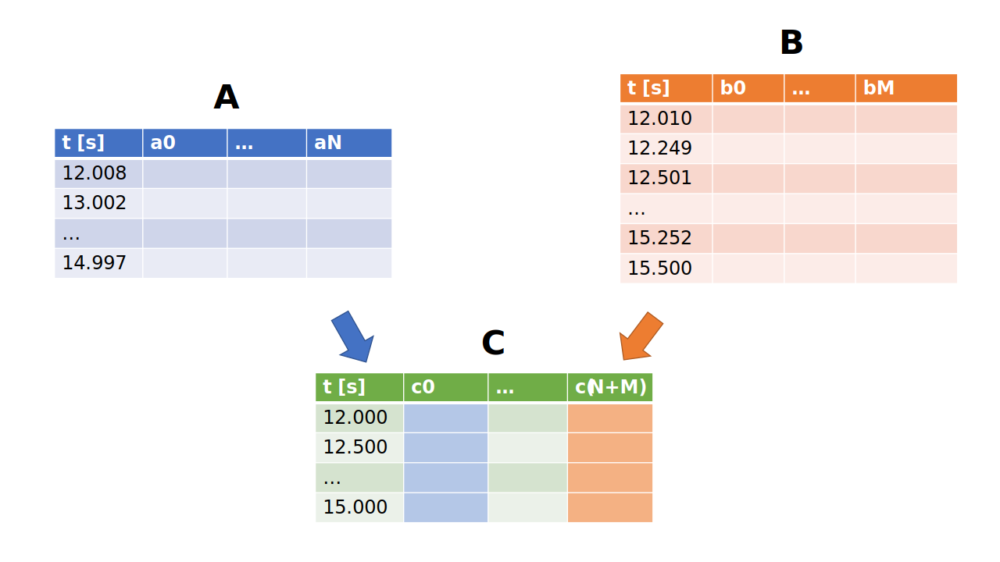

# Merging datasets

## Motivation

Merging two time series datasets with varying sampling frequencies can be a complex and challenging task, 
yet it is a common problem in many fields such as finance, economics, and engineering. 
Time series data refers to a sequence of observations taken at regular intervals over time. 
However, in real-world scenarios, it is not uncommon to have two or more time series datasets collected at different sampling frequencies (as in Fig. 1), 
making it difficult to combine them into a single dataset for analysis.

The problem of merging time series data with varying sampling frequencies arises because the data points in each dataset are not necessarily aligned, 
leading to gaps or overlapping time periods. To merge such datasets, we need to decide how to handle these gaps and overlaps while preserving the integrity of the data. 
Moreover, merging time series datasets requires careful consideration of the data quality, accuracy, and completeness, as well as the statistical properties of the data.

In this chapter we will deal with merging of multiple datasets with varying sample frequencies into one dataset with a predefined frequency \\( f_C \\)  which can be used for further investigation or analysis.

  

<figcaption>

**Figure 1**: Illustration of the merging problem discussed in this chapter. 
Dataset \\( \mathbf A \\) with \\( N \\) columns is sampled with a a frequency of \\( f_A = 1 Hz \\).
Dataset \\( \mathbf B \\) (\\( M \\) columns) which covers similar time period, is sampled with \\( f_B = 4 Hz \\).
The goal is to create a dataset C with a predefined frequency \\( f_C \\) which contains the information from the columns of the source datasets.

</figcaption>

## Methodology (WIP)

1. Interpolate (Up/Downsample the data), decide for each column individually
2. Join the data by time