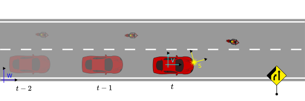

# Transformation

Traffic is dynamic in its nature: vehicles and motorcycles overtake each other, pedestrians appear behind occluded areas or cyclists change from sidewalks onto the driving lane.

In order to describe those interactions quantitatively in terms of distances, velocities and visibilities, also considering sensor positions and the measurement times, transformations between coordinate systems are essential.

<figcaption>

**Figure 1**: Example used in this chapter with 3 coordinate systems (\\( W, V, S \\)), 2 actors, one static object (i.e. lane-ends sign) and 3 timesteps.

</figcaption>

In this chapter we will use the terminology from the ROS framework.[^tf_paper] The examples are visualized in two dimensions, however the extension to 3D is possible.

## Common coordinate systems

For automotive applications where actors interact with static objects like traffic lights or signs, a global coordinate system is helpful. 
This world system \\( W\\) can be used to construct the map with static objects, lanes and other entities relevant for the driving task.

The vehicle system \\(V\\) is used to compute distances to other traffic participants and lanes taking in account the proportions of the vehicle chassis.
The origin of this system can be placed anywhere on the vehicle. Often it is placed on the center of the rear axle.

An autonomous system has at least one sensor which is mounted on the exterior of the vehicle. The measurements from this sensor originate from its own coordinate system \\(S\\).

Of course we can introduce arbitrary number of additional coordinate systems, in case they support a single analysis, e.g. a system for the motorcycle driver.
Having the field of view of the person we can ask questions whether the lane-ends sign is visible to the person at a specific point in time.

## Transformation trees

To transform points between multiple systems, it is essential to understand the concept of *transformation trees* which define the connections between coordinate systems.

  

<figcaption>

**Figure 2**: Transformation tree for the example in Fig. 1

</figcaption>

A *transformation tree* is a directed graph (Fig. 2) with nodes as coordinate systems and transformations between them as vertices. 
In a nutshell, it is helpful to think of the arrows as "mathematical recipes" converting points from one system to another.

Note that the structure of this graph remains same over time, even if the mathematical relation between world and vehicle coordinate systems change.

## Mathematical representation

Let's take a deeper look at mathematical recipes describing the geometrical relation between a single pair of coordinate systems.

### Transformation matrices

A transformation between two coordinate systems \\(c_1, c_2\\) can be represented as a matrix in homogenous coordinates:

\\[
\begin{bmatrix}
x_* \\\\
y_* \\\\
1
\end{bmatrix} = \mathbf T_{c_1 \rightarrow c_2} \mathbf x =
\begin{bmatrix}
\mathbf R & \mathbf d \\\\
0 & 1
\end{bmatrix} \begin{bmatrix}
x \\\\
y \\\\
1
\end{bmatrix}
\\]

The matrix rotations allows an efficient implementation of transformation between coordinate frames. Moreover, we can combine multiple transformations into one:

\\[
\mathbf T_{w \rightarrow s} = \mathbf T_{v \rightarrow s} \mathbf T_{w \rightarrow v}
\\]

This allows us to transform between world and sensor coordinate system with a single matrix \\(\mathbf T_{w \rightarrow s}\\).

The rotation matrix R can also represented as a *quaternion*. A quaternion is one of several mathematical ways to represent the orientation and rotation of an object in two or three dimensions. Quaternions are often used instead of Euler angle rotation matrices because compared to rotation matrices they are more compact, more numerically stable, and more efficient.[^quaternions_rotations]

### Transformations in ROS

http://wiki.ros.org/tf/Overview/Transformations

WIP

## Transformations and Time 

Interpolating between frames in time

WIP

## References

[^tf_paper] [ROS: *tf* library](http://wiki.ros.org/tf)

[^quaternions_rotations] [Wikipedia: Quaternions and spatial rotation](https://en.wikipedia.org/wiki/Quaternions_and_spatial_rotation)