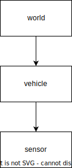

# Transformation

Traffic is dynamic in its nature: vehicles and motorcycles overtake each other, pedestrians appear behind occluded areas or cyclists change from sidewalks onto the driving lane.

In order to describe those interactions quantitatively in terms of distances, velocities and visibilities, also considering sensor positions and the measurement times, transformations between coordinate systems are essential.


<figcaption><center>

**Figure 1**: Example used in this chapter with 3 coordinate systems (\\( W, V, S \\)), 2 actors, one static object (i.e. lane-ends sign) and 3 timesteps.

</center></figcaption>

In this chapter we will use the terminology from the ROS framework.[^tf_paper] The examples are visualized in two dimensions, however the extension to 3D is possible.

## Common coordinate systems

For automotive applications where actors interact with static objects like traffic lights or signs, a global coordinate system is helpful. 
This world system \\( W\\) can be used to construct the map with static objects, lanes and other entities relevant for the driving task.

The vehicle system \\(V\\) is used to compute distances to other traffic participants and lanes taking in account the proportions of the vehicle chassis.
The origin of this system can be placed anywhere on the vehicle. Often it is placed on the center of the rear axle.

An autonomous system has at least one sensor which is mounted on the exterior of the vehicle. The measurements from this sensor originate from its own coordinate system \\(S\\).

Of course we can introduce arbitrary number of additional coordinate systems, in case they support a single analysis, e.g. a system for the motorcycle driver.
Having the field of view of the person we can ask questions whether the lane-ends sign is visible to the person at a specific point in time.

## Transformation trees

To transform points between multiple systems, it is essential to understand the concept of *transformation trees* which define the connections between coordinate systems.

<p align="center">
  
</p>

<figcaption><center>

**Figure 2**: Transformation tree for the example in Fig. 1

</center></figcaption>

A *transformation tree* is a directed graph (Fig. 2) with nodes as coordinate systems and transformations between them as vertices. 
In a nutshell, it is helpful to think of the arrows as "mathematical recipes" converting points from one system to another.

Note that the structure of this graph remains same over time, even if the mathematical relation between world and vehicle coordinate systems change.

## Mathematical representation

Let's take a deeper look at mathematical recipes describing the geometrical relation between a single pair of coordinate systems.

### Transformation operation

A transformation between two coordinate systems \\(A, B\\) can be represented as a matrix in homogenous coordinates:

\\[
\begin{bmatrix}
{}^{A} \vec x \\\\
1
\end{bmatrix}  =
\begin{bmatrix}
{}^{A}_B R & {}^{A}t_B \\\\
0 & 1
\end{bmatrix} \begin{bmatrix}
{}^{B} \vec x \\\\
1
\end{bmatrix} = {}^{A}_B \mathbf T \\ \begin{bmatrix}
{}^{B} \vec x \\\\
1
\end{bmatrix}
\\]

\\[
\begin{bmatrix}
{}^{A} \vec x \\\\
1
\end{bmatrix} = \mathbf T_{B \rightarrow A} \\ \begin{bmatrix}
{}^{B} \vec x \\\\
1
\end{bmatrix}
\\]

Note, that the equation above transforms a single point in \\( B\\)s coord. system to \\( A\\), i.e. \\( {}^{B} \vec x \rightarrow {}^{A} \vec x\\).

The matrix notation allows an computationally efficient transformation between coordinate frames. Moreover, we can combine multiple transformations into one matrix (Eq. 2.40 from [^robotics_book]):

\\[
\mathbf T_{C \rightarrow A} = \mathbf T_{B \rightarrow A} \mathbf T_{C \rightarrow B} 
\\]

Applied to the example from Fig. 1 this formulation allows us to transform between *world* and *sensor* coordinate system with a single operation \\(\mathbf T_{world \rightarrow sensor}\\).

### Reverse transformation

The reverse transformation, i.e. from \\( {}^{A} \vec x \rightarrow {}^{B} \vec x\\) can be achieved by constructing a reverse transformation matrix \\( {}^{A}_B T^{-1}\\) (Eq. 2.45 from [^robotics_book]):

\\[
\begin{bmatrix}
{}^{B} \vec x \\\\
1
\end{bmatrix}  = {}^{A}_B T^{-1} \begin{bmatrix}
{}^{A} \vec x \\\\
1
\end{bmatrix} =
\begin{bmatrix}
{}^{A}_B R^T & -{}^{A}_B R^T {}^{A}t_B \\\\
\mathbf 0 & 1
\end{bmatrix} \begin{bmatrix}
{}^{A} \vec x \\\\
1
\end{bmatrix} = {}^{B}_A \mathbf T \\ \begin{bmatrix}
{}^{A} \vec x \\\\
1
\end{bmatrix}
\\]

Note that the equation above is computationally more efficient than computing an inverse directly.

### Structure of the transformation matrix

The transformation matrix \\( {}^{A}_B T\\) has two components:

- a 3x1 displacement vector \\( {}^{A}t_B \\), which describes the translation of \\(B\\)'s origin in the \\(A\\) system. 
  For a sensor mounted at the front center of a 5m long vehicle, the displacement vector to the center of the veicle would be similar to \\( [2.5, 0, 0]^T\\).
- a 3x3 rotation matrix \\({}^{A}_B R\\), which describes the rotation of the axes of coordinate system \\(B\\) in the \\(A\\).
  I.e. the columns are formed from the three unit vectors of B's axes in A: \\({}^{A}\vec X_B\\), \\({}^{A}\vec Y_B\\), and \\({}^{A}\vec Z_B\\).[^ros_transform]

Let's try to visualize both:


<figcaption><center>

**Figure 3**: Transformation matrix from displacement vector and rotation. The system B is rotated 45° around the z-axis.

</center></figcaption>

The displacement vector is a 3 dimensional vector between the two coordinate system origins. 
The rotation matrix however, is slightly more complex.
As stated above, the columns of the rotation matrix are the axes of the new system B as vectors in A.
Since the system B is rotated around the z-axis, it remains constant, i.e. \\({}^{A}\vec Z_B = [0, 0, 1]^T\\):

\\[
{}^{A}_B R =
\begin{bmatrix}
{}^{A}\vec X_B & {}^{A}\vec Y_B & {}^{A}\vec Z_B
\end{bmatrix}
= \begin{bmatrix}
\cos(\alpha) & -\sin(\alpha) & 0 \\\\
\sin(\alpha) & \cos(\alpha) & 0 \\\\
0 & 0 & 1
\end{bmatrix}
\\]

### Rotation and quaternions

The rotation matrix \\(R\\) can also represented as a *quaternion*. 
A quaternion is one of several mathematical ways to represent the orientation and rotation of an object in three dimensions. 
Quaternions are often used instead of Euler angle rotation matrices because compared to rotation matrices they are more compact, 
more numerically stable, and more efficient.[^quaternions_rotations]

Broadly speaking a unit quaternion \\(\mathbf q\\) holds the information about the rotation axis and 
the rotation angle \\(\alpha\\) (counter-clockwise) a point has to be rotated with:

\\[
\mathbf q =  sin(\frac \alpha 2) (a_x i + a_y j + a_z k) + cos(\frac \alpha 2) \\\\
q_i = sin(\frac \alpha 2) a_x i \\\\
q_j = sin(\frac \alpha 2) a_y j \\\\
q_k = sin(\frac \alpha 2) a_z k \\\\
w = cos(\frac \alpha 2)
\\]

The coefficients \\(a_x, a_y, a_z\\) define the orientation of the rotation axis in the coordinates of the parent system \\(A\\). 
A rotation around the z-axis (as in Fig. 3) would lead to a rotation axis \\(a_x = 0, a_y = 0, a_z = 1\\).
With a rotation angle \\( \alpha\\) we can compute the quaternion \\( [q_i, q_j, q_k, w]\\).
A great resource explaining the quaternions visually can be accessed on YouTube [here](https://youtu.be/zjMuIxRvygQ).

Given a unit quaternion \\( [q_i, q_j, q_k, w]\\) we can construct the rotation matrix

\\[
\mathbf{R} = 
\begin{bmatrix}
1 - 2s (q_j^2 + q_k^2) &
2 (q_i q_j + q_k q_r) &
2 (q_i q_k - q_j q_r) \\\\
2 (q_i q_j - q_k q_r) &
1 - 2s (q_i^2 + q_k^2) &
2 (q_j q_k + q_i q_r) \\\\
2 (q_i q_k + q_j q_r) &
2 (q_j q_k - q_i q_r) &
1 - 2s (q_i^2 + q_j^2)
\end{bmatrix} 
\\]

This computation is implemented in [SciPy](https://docs.scipy.org/doc/scipy/reference/generated/scipy.spatial.transform.Rotation.from_quat.html#scipy.spatial.transform.Rotation.from_quat).

## Transformations in ROS

Transformations in ROS are transmitted via the TransformStamped message type:

```
Header header
- uint32 seq
- time stamp
- string frame_id  # parent frame (A)

string child_frame_id # child frame (B)

Transform transform
    - geometry_msgs/Vector3 translation  # displacement vector A -> B
        - float64 x
        - float64 y
        - float64 z
    - geometry_msgs/Quaternion rotation  # rotation matrix as quaternion
        - float64 x
        - float64 y
        - float64 z
        - float64 w
```

Note that the `translation` and `rotation` attribute hold \\( {}^{A}t_B \\) and \\( {}^{A}_B R \\) respectively. 
The `frame_id` refers to coordinate system \\( A \\) and `child_frame_id` to \\( B \\).

## Transformation of multiple points

For data processing in Python, vectorized operations (e.g. in `numpy` ) are often faster than looping over a list of points and apply the transformation equation repeatedly.[^real_python_numpy_programming]

The transformation equation can be extended to deal with a list of multiple points. This is particularly helpful for transforming geometric objects, 
such as line-strings, bounding boxes or polygons, which are defined as an ordered list of points.:

\\[
\begin{bmatrix}
{}^{A} \vec x & \dots & {}^{A} \vec x_N \\\\
1 & \dots & 1
\end{bmatrix} = \mathbf T_{B \rightarrow A} \\ \begin{bmatrix}
{}^{B} \vec x_1 & \dots & {}^{B} \vec x_N \\\\
1 & \dots & 1
\end{bmatrix}
\\]

## Transformations and time

In automotive applications we deal often with moving objects such as our vehicle or the objects like pedestrians which we are interacting with.
The shape of the transformation tree is often unchanged (i.e. same number of nodes and vertices),
but the transformation matrices, i.e. arrows in Fig. 4, change over time.

Now, think of a use-case as in Fig. 4, where you require a transformation from coordinate system \\( A \\) to system \\( C \\) at a specific query time \\( t_q \\). 

<p align="center">
  
</p>

<figcaption><center>

**Figure 4**: Querying the coordinate transformation from \\( A \\) to \\( C \\) at query time \\( t_q \\).
The color of a transformation arrow corresponds to the transformation samples visualized over time (from left to right).

</center></figcaption>

For the \\( {}_B^C \mathbf T (t^q)  \\) we can take an existing sample directly, 
for the \\( {}_A^B \mathbf T (t^q)  \\) however, we are required to interpolate. In that case the method *spherical linear interpolation* (in short *SLERP*) can be used, 
assuming rotation with uniform angular velocity around a fixed rotation axis.[^slerp] In Python, SLERP [is implemented](https://docs.scipy.org/doc/scipy/reference/generated/scipy.spatial.transform.Slerp.html) 
in the `scipy.spatial.transform.Slerp` function.

Note that SLERP is only applied on the rotation part of the \\( \mathbf T \\) homog. matrix, not the translation. 
For the translation linear interpolation can be used (refer to the Interpolation chapter in this book).

After that, we can apply the chaining equation from the corresponding section:

\\[
{}_C^A \mathbf T(t^q) = {}_B^A \mathbf T(t^q) {}_C^B \mathbf T(t^q)
\\]

An example of this computation is the transformation of a sensor (e.g. from LIDAR) reading
to world coordinates (\\( {}_C^S \mathbf T (t^q)  \\) ) for mapping purposes.


## References

[^tf_paper] [ROS: *tf* library](http://wiki.ros.org/tf)

[^robotics_book] John Craig, *Introduction to Robotics* (1989)

[^quaternions_rotations] Wikipedia: Quaternions and spatial rotation ([source](https://en.wikipedia.org/wiki/Quaternions_and_spatial_rotation))

[^ros_transform] ROS Overview - Transformations ([source](http://wiki.ros.org/tf/Overview/Transformations))

[^ros_transform_stamped] `geometry_msgs/TransformStamped` Message [docs](http://docs.ros.org/en/melodic/api/geometry_msgs/html/msg/TransformStamped.html)

[^real_python_numpy_programming] Real Python - *Look Ma, No For-Loops: Array Programming With NumPy*, [link](https://realpython.com/numpy-array-programming/#what-is-vectorization)

[^slerp] [Wikipedia: Quaternion Slerp](https://en.wikipedia.org/wiki/Slerp#Quaternion_Slerp)