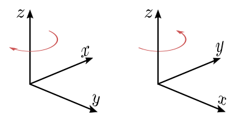
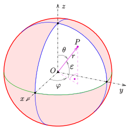

# Coordinate systems

## Cartesian coordinate system

### Introduction

This system is the first system we hear about in high school. First it is taught in terms of *x,y*-graphs where pupils enter pairs of numbers in a 2-D system. Later, we learn the term *function* which is can be represented graphically as a curve in this system.

A bit about history: Cartesian coordinates are named for René Descartes whose invention of them in the 17th century revolutionized mathematics by providing the first systematic link between geometry and algebra. Using the Cartesian coordinate system, geometric shapes (such as curves) can be described by equations involving the coordinates of points of the shape.[^wiki_cartesian_system]

### Left- vs. right-handed

In 2-D system, the position of x and y is fixed for many people, where the y axis is usually pointed toward the north. For a 3-D system however, there are multiple definitions:

  

<figcaption>

**Figure 1**: Left-handed coordinates on the left, right-handed coordinates on the right. [Image from Wikipedia](https://en.wikipedia.org/wiki/Right-hand_rule#/media/File:Cartesian_coordinate_system_handedness.svg)

</figcaption>

For **right-handed** coordinates, the right thumb points along the z-axis in the positive direction and the curling motion of the fingers of the right hand represents a motion from the first or x-axis to the second or y-axis. When viewed from the top or z-axis the system is counter-clockwise.[^wiki_right_hand_rule] Robotic applications and frameworks such as ROS, use the right hand-rule, see [^ros_rep103].

For left-handed coordinates, the left thumb points along the z-axis in the positive direction and the curling motion of the fingers of the left hand represent a motion from the first or x-axis to the second or y-axis. When viewed from the top or z-axis the system is clockwise.[^wiki_right_hand_rule]

## Spherical coordinate system

Spherical coordinate system is used across a a wide palette of applications, besides astronomy and geo-informatics, it is essential for automotive applications, too. A RADAR or LIDAR sensor output their readings by providing the range, azimuth- and elevation-angle to the object of the detection. This section provides a short overview over notation, characteristics and commonly used coordinate transformations.

A spherical coordinate system (Fig. 2) is defined over the radial distance \\( r \\), azimuth angle \\( \varphi \\) and inclination angle \\( \theta \\):

  

<figcaption>

**Figure 2**: Right-handed cartesian and spherical coordinate system in ISO 80000-2:2019 convention.  [Image from Wikipedia](https://de.wikipedia.org/wiki/Kugelkoordinaten#/media/Datei:Kugelkoord-def.svg), extended with \\( \varepsilon \\) elevation angle.

</figcaption>

The angle the  \\( \varepsilon = \frac \pi 2 - \theta \\) is often used instead of \\( \theta \\) for data coming from RADAR or LIDAR sensors. When referring to field of view of a sensor, a horizontal range refers to the extent of \\( \varphi \\) and vertical to \\( \varepsilon \\).

### Transformation to Cartesian

The spherical coordinates of a point in the ISO convention (i.e. for physics: radius r, inclination θ, azimuth φ) can be obtained from its Cartesian coordinates (x, y, z) by the formulae[^wiki_spher_system]:

\\[
r = \sqrt{x^2 + y^2 + z^2} \\\\
\theta = \arccos\frac{z}{\sqrt{x^2 + y^2 + z^2}} \\\\
\varphi = sgn(y)\arccos\frac{x}{\sqrt{x^2+y^2}}
\\]

The sign function \\( sgn(x) \\) returns 1 for positive numbers \\( x > 0\\), 0 for \\( x = 0\\) and -1 for negative \\( x < 0\\).[^wiki_sign_function]

Conversely, the Cartesian coordinates may be retrieved from the spherical coordinates by[^wiki_spher_system]:

\\[
x = r \sin\theta \\, \cos\varphi \\\\
y = r \sin\theta \\, \sin\varphi \\\\
z = r \cos\theta
\\]

## References

[^wiki_cartesian_system] Wikipedia - Cartesian Coordinate System, [link](https://en.wikipedia.org/wiki/Cartesian_coordinate_system)

[^wiki_right_hand_rule] Wikipedia - Right hand rule, [link](https://en.wikipedia.org/wiki/Right-hand_rule)

[^ros_rep103] ROS REP103 - Standard Units of Measure and Coordinate Conventions, [link](https://www.ros.org/reps/rep-0103.html#coordinate-frame-conventions)

[^wiki_spher_system] Wikipedia - Spherical coordinate system, [link](https://en.wikipedia.org/wiki/Spherical_coordinate_system#Cartesian_coordinates)

[^wiki_sign_function] Wikipedia - Sign function, [link](https://en.wikipedia.org/wiki/Sign_function)