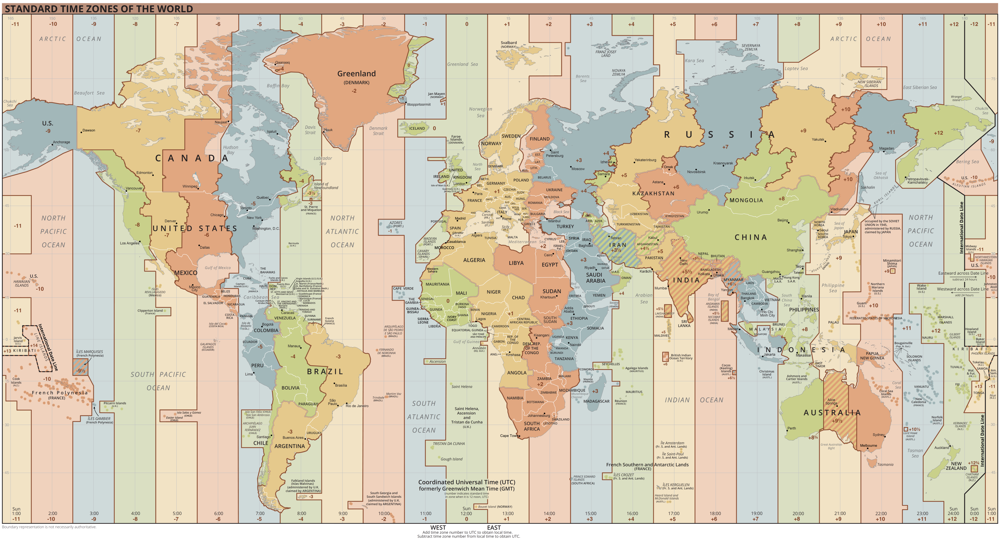

# Time

Computers are discrete in nature - thus we need a discrete representation as a datatype. Commonly
time is represented as an array of timestamps: 


```python
# 3 seconds in Vienna (Central European Time: +1:00)
[
    '2009-01-01T12:00:00+01:00',
    '2009-01-01T12:00:01+01:00',
    '2009-01-01T12:00:02+01:00',
    ...
]
```

Timestamps can be timezone-aware or when we work only in once time-zone, without any timezone information,
e.g. `2009-01-01T12:00:00`. A good practice is to convert the local timestamps into UTC (`+0:00`) prior
to further processing.

## UTC

No matter which timezone you are in, you can always represent the time in a standardized way by using the Coordinated Universal Time or UTC.


Coordinated Universal Time or UTC is the primary time standard by which the world regulates clocks and time.
UTC is used in many Internet and World Wide Web standards. The Network Time Protocol (NTP), designed to synchronise the clocks of computers over the Internet, transmits time information from the UTC system. If only milliseconds precision is needed, clients can obtain the current UTC from a number of official internet UTC servers. For sub-microsecond precision, clients can obtain the time from satellite signals.[^wiki-utc]

## Unix time

Wikipedia provides a short and precise description[^wiki_unixtime]:

> Unix time is a date and time representation widely used in computing. It measures time by the number of seconds that have elapsed since 00:00:00 UTC on 1 January 1970, the beginning of the Unix epoch, without adjustments made due to leap seconds.

That means that our initial example from Vienna turns to:

```python
# 3 seconds in Vienna (Central European Time: +1:00)
[
    3600,
    3601,
    3602,
    ...
]
```

The unix-time in the moment of writing (Sun Apr 16 2023 09:08:10) is `1681636090`.

## Timezones

To quote Wikipedia, timezones are:

> A time zone is an area which observes a uniform standard time for legal, commercial and social purposes. Time zones tend to follow the boundaries between countries and their subdivisions instead of strictly following longitude, because it is convenient for areas in frequent communication to keep the same time.

To add to this definition, is that each timezone is defined by a temporal offset (in hours) relative to the Coordinated Universal Time (UTC). Timezones
west to Greenwich are often negative, those to the east positive.

Some examples:

- Central European Time (CET) is defined by a positive offset (`+1:00` in winter and `+2:00` in summer).
- The Pacific Time Zone (PT) has a negative offset (`-8:00` in winter and `-7:00` in summer).
- India Standard Time (IST) has an "unround" offset `+5:30`

<p align="center">
  
</p>

<figcaption><center>

**Figure 1**: Time zones of the world. [Image from Wikipedia](https://en.wikipedia.org/wiki/Time_zone#/media/File:World_Time_Zones_Map.png).

</center></figcaption>

Prior the the 19th century people were using *solar time*, so when it was noon in London, it is about 10 minutes before solar noon in Bristol.
This variation corresponds to four minutes of time for every degree of longitude.[^wiki_timezone_history] You can imagine that with that system,
it is not convenient to schedule meetings or public transport.

### Implementation in Python

The preferred way of dealing with times is to always work in UTC, converting to localtime only when generating output to be read by humans.

In Python, you can create a *datetime-aware* timestamp (i.e. a timestamp with timezone description) passing a `tzinfo` argument. This argument should be a subclass of `tzinfo` - such as the [`timezone`](https://docs.python.org/3/library/datetime.html#timezone-objects) object:

```python
from datetime import datetime, timedelta, timezone

# create a timestamp in Germany (Central European Summer Time +2:00)
cest_tz = datetime.timezone(datetime.timedelta(seconds=2*3600))
time = datetime.datetime(2023, 5, 14, 18, 55, tzinfo=cest_tz)

# convert to UTC:
time.astimezone(timezone.utc)
# > datetime.datetime(2023, 5, 14, 16, 55, tzinfo=datetime.timezone.utc)
```

Some time-zones have non-static (e.g. different in winter and summer) offsets, such as Central European (Summer) Time for daylight saving. For that cases,
consider using [`zoneinfo`](https://docs.python.org/3/library/zoneinfo.html#module-zoneinfo) module:

```python
import zoneinfo

berlin_tz = zoneinfo.ZoneInfo("Europe/Berlin")
time = datetime.datetime(2023, 5, 14, 18, 55, tzinfo=berlin_tz)
```

This code makes sure, that any conversion to UTC will produce the right result, independent of daylight time.

## Relative vs. absolute times

Some applications do not require the knowledge of the absolute time, a relative time (wrt start of the recording)
is often enough, there we can use floating point arrays. Especially memory intensive applications use that approach,
where it is easier to save the start time as timestamp and save the rest as an array of integers or floats.

## References

[^wiki_unixtime] Wikipedia - Unix Time ([link](https://en.wikipedia.org/wiki/Unix_time))

[^wiki_timezone_history] Wikipedia - Time Zone History ([link](https://en.wikipedia.org/wiki/Time_zone#History))

[^wiki-utc] Wikipedia - UTC ([link](https://en.wikipedia.org/wiki/Coordinated_Universal_Time))