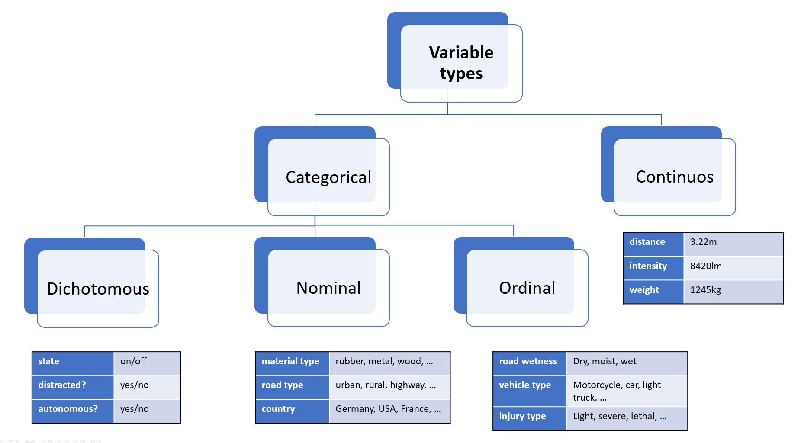

# Variable types

## Overview

In the context of automotive data analysis, a variable can be thought of as a (static) characteristic or a measurement that can change or vary over time. 
Variables can be used to describe different aspects of the environment or the vehicle itself, such as its position, speed, acceleration, size, distance, object type or colour.

Variables play a crucial role in automotive data analysis because they allow us to measure and quantify the behavior of a vehicle and its surroundings. By collecting and analyzing data on these variables, we can gain insights into how an (automated) vehicle is performing, identify critical situations, evaluate the sensor performance and finally reason about its safety.

It's important to note that variables in automotive data analysis can come in different forms, such as continuous variables (e.g., speed, size or acceleration) or categorical variables (e.g., material, colour and model of the vehicle).

## Taxonomy

### Categorical variables

**Nominal** variables are variables that have categories or labels with no inherent order or hierarchy. For example, in automotive data analysis, a nominal variable could be the make or model of a vehicle. Each vehicle belongs to a particular make and model category, but there is no inherent order or ranking between different categories. 

**Dichotomous** variables are variables that have only two possible categories or values. 
For example, in automotive data analysis, a dichotomous variable could be whether a vehicle is electric or gasoline-powered. Dichotomous variables are often analyzed using binary logistic regression, which can help identify factors that are associated with the presence or absence of a particular category or value.

**Ordinal** variables, on the other hand, have categories or labels that can be ranked or ordered based on their relative value or magnitude. 
For example, in automotive data analysis, an ordinal variable could be the level of fuel efficiency of different vehicles, which can be ranked from most fuel-efficient to least fuel-efficient. Ordinal variables are analyzed using measures such as median and quartiles, which can provide insights into the central tendency and variability of the data.

### Continuous variables

Another important type of variable in statistics is the **continuous** variable. 
Unlike nominal, ordinal, and dichotomous variables, which are categorical in nature,
continuous variables are numerical and can take any value within a range.

Note that you can define either ordinal variables based on intervals of a single continuous variable,
which can sometimes simplify an analysis or a metric.

## Representation in Python

The following table gives a high level overview about the recommended representation of the above mentioned types
in Python. In addition to Python-native types included in the standard library, the table lists types used in
`numpy` and `pandas`, which is more convenient for larger analysis tasks.

Of course you can also represent a nominal variable with pre-defined `float` values such as `[0.0, 1.0, 2.0]` for "truck", "bus" and "motorcycle",
but the further data-processing and code is less efficient (e.g. `float16` needs double the memory of `int8`), and more error prone. 
In addition you would also miss mechanisms from libraries like `pandas`,
which prevent computing the `mean()` on a categorical column.

The time can be represented as a continuous variable, however there are specialized datatypes in both Python's standard lib and numpy/pandas.
This enables a more convenient handling with time zones and facilitates doing algebra (e.g. computing time differences).

| **Variable type** | **scalar**         | **numpy** [^numpy-dtypes]          | **pandas**         |
|-------------------|--------------------|---------------------|--------------------|
| Nominal           | `int`, `enum.Enum` | `int8`              | `CategoricalDtype` |
| Ordinal           | `ìnt`, `enum.Enum` | `int8`              | `CategoricalDtype` |
| Dichotomous       | `bool`             | `bool` [^np-bool]   | `bool`             |
| Continuous        | `float`            | `float32`, `double` | `float32`, `double`|
| Time        | `float` / `datetime.datetime` | `datetime64`  | `datetime64` |

Note that you can convert a continuous variable to a ordinal one using `pandas.cut` function.

## Exercises

1. Create an array of 100 uniformly distributed random numbers (0-150m) representing the measured distance from a LIDAR sensor. Categorize them in three groups, for <50m, <100m, <150m. Count the number of occurrences for each group.
2. What is the most-memory efficient datatype for representing human weight? How would you represent time for a lane change manoeuvre?

## References

[^numpy-dtypes] Refer to the official NumPy [docs](https://numpy.org/doc/stable/user/basics.types.html#array-types-and-conversions-between-types) for reference regarding internal representation in memory.