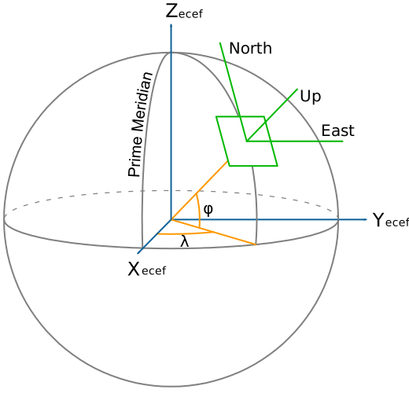

# Fundamentals

This chapter provides a high level overview about the mathematical description of the Earth.

## Geographic coordinates

In order to communicate locations geographic coordinates on our planet, a pair of **latitude** and **longitude** are used (Fig. 1).

<p align="center">
  
</p>

<figcaption><center>

**Figure 1**: Geographic coordinates overview with parallels (blue) and meridians (red). The prime meridian (longitude 0°) intersects Greenwich.
Edited Image from: [Wikipedia](https://en.wikipedia.org/wiki/Geographic_coordinate_system)

</center></figcaption>

Note, that the pair of coordinates is usually reported with longitude first in geographic software applications and tools, since east-west looks like an x coordinate.[^maps-book]

## Geoid

An important concept to understand is that, the Earth's surface is irregular. Its surface can be described
with a **geoid**, defined as the shape of the surface of the earth if it were completely covered with water (Fig. 1).[^maps-book]

The models taught in school, like Earth being a sphere or a ellipsoid (obtained by rotating 
an ellipse about one of its principal axes) are sufficient to explain many 
things like movement of the planets, sunrise, horizon etc.

Fig. 2 shows an exaggerated shape of the Earth with vertical scaling of the heights and lows.

<p align="center">
  
</p>

<figcaption><center>

**Figure 2**: Earth geoid model (Source: [DJI](https://enterprise-insights.dji.com/blog/geoid-vs-ellipsoid))

</center></figcaption>

The study of the Earth’s surface (i.e. geoid) is called **geodesy**.

In order to deal with the complex shape mathematically, **geodetic systems** or **geodetic datums** are introduced.

## Geodetic datum

A geodetic datum is a reference coordinate system, describing the Earth's geoid as a 3-dimensional mathematical shape (e.g. sphere or ellipsoid).

In Wikipedia, it is defined as following[^geodetic-datum-wiki]:

> A geodetic datum [...] is a reference frame for precisely representing the position of locations on Earth or other planetary bodies by means of geodetic coordinates.

In Fig. 3 the ellipsoid from the widely used 1984 World Geodetic System (WGS84) is visualized.
Modern navigation systems based on GPS use WGS84.

<p align="center">
  
</p>

<figcaption><center>

**Figure 3**: 1984 World Geodetic System Ellipsoid with Equatorial (a), polar (b) and mean Earth radii.[^geodetic-datum-wiki]

</center></figcaption>

Other satellite navigation systems, such as Galileo (European Union) or GLONASS (Russia)
use other geodetic datums such as  Galileo Terrestrial Reference Frame (GTRF) 
or Parametry Zemli 1990 (Parameters of the Earth 1990) (PZ-90) respectively.[^esa-reference-frames]

In the Fig. 4 the definition of geographic coordinates on a geodetic datum is visualized. Note that the latitude \\( \phi \\) is defined by the equatorial plane and a line that is normal to the reference ellipsoid. 

<p align="center">
  
</p>

<figcaption><center>

**Figure 4**: Geodetic coordinates: longitude \\( \lambda \\), latitude \\( \phi \\) and altitude \\( h \\).[^geodetic-coords-wiki]

</center></figcaption>

Contrary to the *geodetic* latitude (Fig. 4), the *geocentric* latitude is the angle between the equatorial plane and the radius from the centre to a point of interest. On its own, the term "latitude" normally refers to the geodetic latitude.[^latitude-wiki]

## Earth-centered, Earth-fixed coordinate system (ECEF)

As with any spatial reference system, ECEF consists of an abstract coordinate system (in this case, a conventional three-dimensional right-handed system), and a geodetic datum that binds the coordinate system to actual locations on the Earth.[^ecef-wiki]

<p align="center">
  
</p>

<figcaption><center>

**Figure 5**: Earth-centered, Earth-fixed coordinate system together with geodetic coordinates. Image from [^ecef-wiki]

</center></figcaption>

The ECEF coordinate system has the following parameters:

- The origin at the center of the chosen ellipsoid. In WGS84, this is center of mass of the Earth.
- The Z axis is the line between the North and South Poles, with positive values increasing northward.
- The X axis is in the plane of the equator, passing through the origin and extending from 180° longitude (negative) to the prime meridian (positive)
- The Y axis is also in the plane of the equator, passing through extending from 90°W longitude (negative) to 90°E longitude (positive)

## Conversion ECEF ↔ Geodetic

Given geodetic coordinates (longitude \\( \lambda \\), latitude \\( \phi \\) and altitude \\( h \\)), 
one can compute the metric ECEF coordinates of the point as follows[^geodetic-coords-wiki]:

\\[
X = (N + h) \cos{\phi} \cos{\lambda} \\\\
Y = (N + h) \cos{\phi}\sin{\lambda} \\\\
Z = (\frac{b^2}{a^2} N + h) \sin{\phi}
\\]

where \\( a, b \\) are the equatorial radius (semi-major axis) and the polar radius (semi-minor axis), respectively. N is the prime vertical radius of curvature, function of latitude \\( \phi \\):

\\[
N = \frac{a^2}{\sqrt{a^2 \cos^2 \phi + b^2 \sin^2 \phi}}
\\]

Those equations are implemented in `pyproj`:

```python
import pyproj

ecef = pyproj.Proj(proj='geocent', ellps='WGS84', datum='WGS84')
lla = pyproj.Proj(proj='latlong', ellps='WGS84', datum='WGS84')

# convert (WGS84 -> ECEF)
x, y, z = pyproj.transform(lla, ecef, lon, lat, alt, radians=False)

# convert (ECEF -> WGS84)
lon, lat, alt = pyproj.transform(ecef, lla, x, y, z, radians=False)
```

## Local east, north, up (ENU) coordinates

In many targeting and tracking applications the local East, North, Up (ENU) Cartesian coordinate system (Fig. 6) is far more intuitive and practical than ECEF or Geodetic coordinates. The local ENU coordinates are formed from a plane tangent to the Earth's surface fixed to a specific location and hence it is sometimes known as a "Local Tangent" or "local geodetic" plane. By convention the east axis is labeled x, the north y and the up z.[^local-tangent-wiki]

<p align="center">
  
</p>

<figcaption><center>
**Figure 6**: The east north up (ENU) system together with ECEF and geodetic coordinates. Image from [^ecef-wiki]
</center></figcaption>

In Python, the transformation between geodetic and ENU coordinates is implemented in `pymap3d` library:

```python
import pymap3d as pm

# ENU coordinate origin (Zermatt, Switzerland)
lat0 = 46.017 # deg
lon0 = 7.750  # deg
h0 = 1673     # meters

# The point of interest
lat = 45.976  # deg
lon = 7.658   # deg
h = 4531      # meters

# by default uses the ellipsoid from WGS-84
pm.geodetic2enu(lat, lon, h, lat0, lon0, h0)
# returns: (-7134.757195979863, -4556.321513844541, 2852.3904239436915)
```

In MATLAB, `geodetic2enu` function can be used.

## References

[^maps-book] Peter Anthamatten - *How to Make Maps, An Introduction to Theory and Practice of Cartography* (2021)

[^geodetic-datum-wiki] https://en.wikipedia.org/wiki/Geodetic_datum

[^esa-reference-frames] Reference Frames in GNSS https://gssc.esa.int/navipedia/index.php/Reference_Frames_in_GNSS

[^geodetic-coords-wiki] Wikipedia - Geodetic coordinates https://en.wikipedia.org/wiki/Geodetic_coordinates

[^latitude-wiki] Wikipedia - Latitude  https://en.wikipedia.org/wiki/Latitude

[^ecef-wiki] Wikipedia - Earth-centered, Earth-fixed coordinate system https://en.wikipedia.org/wiki/Earth-centered,_Earth-fixed_coordinate_system

[^local-tangent-wiki] Wikipedia - Local tangent plane coordinates https://en.wikipedia.org/wiki/Local_tangent_plane_coordinates