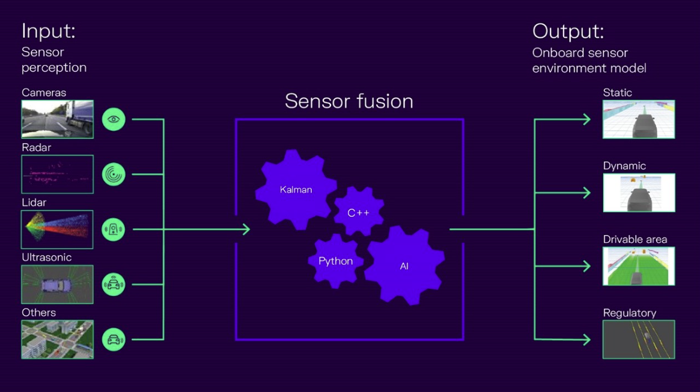

# Overview

Perception is the process by which robots are able to gather and interpret data from their environment using sensors and algorithms. Perception is a crucial component of robotics, as it allows robots to understand and respond to their surroundings, enabling them to perform tasks autonomously and interact with humans and other machines.

Robotics perception involves the use of a wide range of sensors, including cameras, LIDAR, RADAR, and other types of sensors that allow robots to detect and interpret visual, auditory, and tactile information. By processing and combining this heterogenous sensory data using advanced algorithms, robots can determine the location and orientation of objects in their environment, identify and track moving objects, and detect obstacles and other potential hazards. The outputs can be summarized as *environment model* which is a set of one or multiple representations (Fig. 1).

<p align="center">
  
</p>

<figcaption><center>

**Figure 1**: Simplified perception overview with multiple sensor modalities combined together to an environment model. The output is used by the planning stack. (Source: CARIAD[^cariad-sensor-fusion])

</center></figcaption>

One of the key challenges in robotics perception is developing algorithms that are capable of interpreting the complex and often ambiguous data generated by these sensors. This requires sophisticated machine learning techniques, including computer vision and neural networks. Furthermore,
those algorithms shall run on embedded hardware, which often less compute than a consumer grade computer.

## Sensor data

In the majority of cases, a sensor device has its own signal processing unit, it provides the tracked objects as lists of coordinates and 
sizes as an *object list*:

```python
[
    Object(id=12, x=100.2, y=-5.2, z=0.4, 
      width=2.1, length=5.1, height=1.4, lifetime=10.2),
    Object(id=42,x=110.5, y=6.7, z=0.31, 
      width=2.2, length=4.9, height=1.6, lifetime=0.0),
    ...
]
```

The goal of the sensor fusion is to combine multiple (per sensor) object lists from multiple sensors to a single, *global* object list.

## References

[^cariad-sensor-fusion] CARIAD - *How to reach higher automation levels with AI-based sensor fusion?* ([link](https://cariad.technology/de/en/news/stories/sensor-fusion-introduction.html))