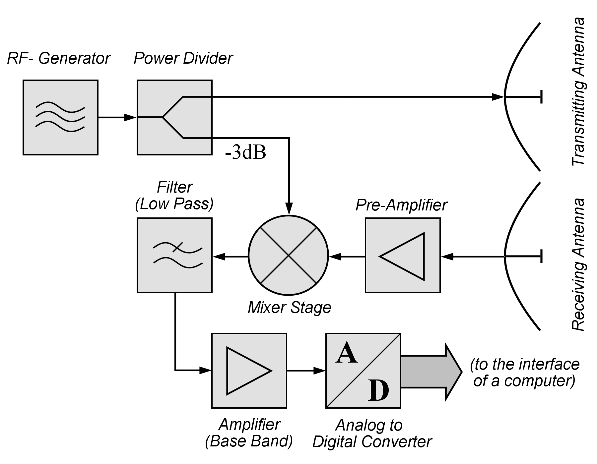

# RADAR

## Overview

Radar sensors are electronic devices that use radio waves to detect and locate objects in their surroundings. The term "radar" stands for "radio detection and ranging," and the technology has been in use for many years in a variety of applications, from military defense to weather forecasting and air traffic control.

  

<figcaption>

**Figure 1**: Automotive-grade RADAR sensor (Source: Bosch[^bosch-radar])

</figcaption>

In robotics, radar sensors are typically used to provide information about the robot's environment, such as the location and movement of nearby objects. The sensors emit radio waves, which bounce off nearby objects and are then detected by the sensor. By measuring the time it takes for the waves to bounce back, the sensor can determine the distance to the object.

One of the key advantages of radar sensors is that they are able to operate in a wide range of environments and weather conditions, including rain, fog, and snow. This makes them particularly useful in outdoor applications, such as autonomous vehicles[^bosch-radar] and drones.

## Radar equation

In order to be detected by the radar sensor system, every object, regardless of the method used,
must reflect the emitted waves of wavelength \\(\lambda \\). The reflected power \\(P_r \\) (received) is described
by the radar equation[^intro-radar-systems-skolnik]:

\\[
P_r = \frac{P_t G_t G_r \lambda^2 \sigma}{(4 \pi)^3 R^4}
\\]

The largest impact on the reflected power is the distance \\(R\\) between the antenna and the target.
Thus there are limits on the maximum detectable (visible) distance given by the radar hardware. Typical 
(automotive) radar sensors provide a range of 200m.[^bosch-radar][^continental-radar]

The characteristic of the particular target is described with the *radar cross section* (RCS) σ which
is range-independent. It has units of area (m2, dBsm or dBm2) and is a measure of its "visibility" or size as
seen by the radar[^intro-radar-systems-skolnik]. Higher values indicate high reflectivity.

In order to work with radar data it is helpful to know the typical RCS ranges for different targets
in various orientations. Typically, we can expect a range from −10dBm² to 25dBm² in a highway environment.

## Doppler effect (WIP)

## FMCW Radar (WIP)

  

<figcaption>

**Figure 2**: CW Radar (Source: Wikipedia[^cw-radar-wiki])

</figcaption>

  

<figcaption>

**Figure 3**: Range-Doppler matrix with 3 moving targets. (Source: Mathworks)

</figcaption>

## References

[^bosch-radar] Robert Bosch GmbH - *Front Radar Sensor* ([link](https://www.bosch-mobility.com/en/solutions/sensors/front-radar-sensor/))

[^intro-radar-systems-skolnik] Merrill I. Skolnik. Introduction to radar systems. McGraw-Hill electrical engineering series. 2001

[^continental-radar] Continental - Advanced Radar Sensor – ARS510 ([link](https://www.continental-automotive.com/DE/Passenger-Cars/Autonomous-Mobility/Enablers/Radars/Long-Range-Radar/ARS510))

[^cw-radar-wiki] Wikipedia *Continuous-wave radar* ([link](https://en.wikipedia.org/wiki/Continuous-wave_radar))