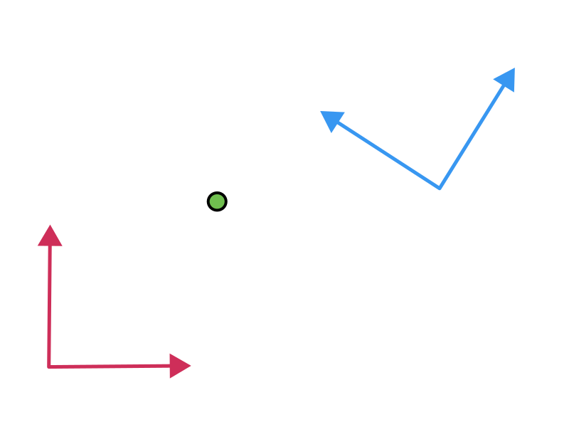

# Motivation

## Foreword

Coordinate transformations are needed in the technical and industrial context for various reasons:

- Integration of components and actors: When different components or systems need to work together in a facility, it may be necessary to align their coordinate systems. This enables seamless integration and smooth exchange of information. As illustrated in the "factory of the future" example (Fig. 1), a robot perceiving a person with its sensors needs to transmit the position to other robots as a trigger for the next task or a collision warning.
- Alignment and orientation: During assembly or alignment of parts or machinery, determining their positions and orientations relative to each other is often necessary. Coordinate transformations allow measurements in one coordinate system to be transferred to another, enabling precise alignment determination.
- Machine vision, tracking and robotics: In fields such as machine vision and robotics, coordinate transformations are used to unify information from different sensors or cameras into a common coordinate system. This enables precise positioning, object detection, and decision-making. This is in particular important for autonomous vehicles perceiving its environment from multiple sensors mounted on different places and heights.

  

<figcaption>

**Figure 1**: Factory of the Future, Image from Comau North America ([source](https://www.automationalley.com/articles/building-the-factory-of-the-future-comaus-approach-to-industry-4-0))

</figcaption>

Through coordinate transformations, data and information can be transferred, integrated, and analyzed between different coordinate systems to understand, control, and optimize complex technical and industrial processes.

## Transformation operation

In a nutshell, the core operation is to convert a point given in one coordinate system to another (Fig. 2):

  

<figcaption>

**Figure 2**: A common use case is to convert the location (x, y) of the green point from one coordinate system (red) to another (blue)

</figcaption>

A transformation is an operation where the initial coordinate system is moved and rotated. The "move" operation is called **translation**.

A transformation of a point in coordinate system B (i.e  \\({}^{B} \vec x\\)) to the coordinate system A can be computed with a matrix multiplication in homogenous coordinates:

\\[
\begin{bmatrix}
{}^{A} \vec x \\\\
1
\end{bmatrix}  = {}^{A}_B \mathbf T \\ \begin{bmatrix}
{}^{B} \vec x \\\\
1
\end{bmatrix}
\\]

The 4x4 matrix \\( {}^{A}_B \mathbf T \\) is called the transformation matrix between the coordinate systems A and B.

By inverting the transformation matrix we can revert the operation:

\\[
\begin{bmatrix}
{}^{B} \vec x \\\\
1
\end{bmatrix}  = {}^{A}_B \mathbf T^{-1} \begin{bmatrix}
{}^{A} \vec x \\\\
1
\end{bmatrix} = {}^{B}_A \mathbf T \\ \begin{bmatrix}
{}^{A} \vec x \\\\
1
\end{bmatrix}
\\]

## Learning goals

- Know and understand the value of coordinate transformations
- Understanding the terminology and fundamental mathematical concepts
- Describe the transformation conversion mathematically and implement it

