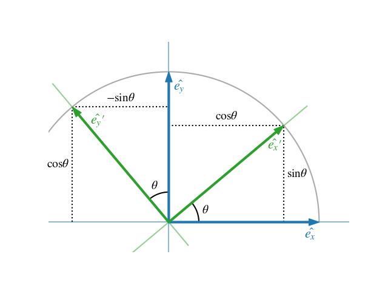

# Rotation

As outlined in previos sections, a transformation is a combination of translation and rotation. In this section, the rotation part will be discussed.

In geometry, various formalisms exist to express a rotation in three dimensions as a mathematical transformation.[^rotation-formalisms-wiki] Some examples:

- Rotation matrices
- Euler axis and angle
- Euler rotations
- Quarternions

In general, according to Euler's rotation theorem the rotation of a rigid body (or three-dimensional coordinate system with the fixed origin) is described by a single rotation about some axis. Such a rotation may be uniquely described by a minimum of three real parameters.[^rotation-formalisms-wiki]

## Rotation formalisms

### Rotation matrix

A 3x3 rotation matrix \\({}^{A}_B R\\) describes the rotation of the axes of coordinate system \\(B\\) relative to system \\(A\\).

The columns are formed from the three unit vectors of B's axes expressed in A: \\({}^{A}\vec X_B\\), \\({}^{A}\vec Y_B\\), and \\({}^{A}\vec Z_B\\).[^ros_transform]

\\[
{}^{A}_B R =
\begin{bmatrix}
{}^{A}\vec X_B & {}^{A}\vec Y_B & {}^{A}\vec Z_B
\end{bmatrix}
\\]

An illustration of the 2-dimensional case can be found in Fig. 1. The unit vectors of the system B are expressed as vectors in system A:

\\[
{}^{A}_B R = \begin{bmatrix}
{}^{A}\vec X_B & {}^{A}\vec Y_B
\end{bmatrix} = \begin{bmatrix}
\cos \theta & -\sin \theta \\\\ 
\sin \theta & \cos \theta 
\end{bmatrix}
\\]

  

<figcaption>

**Figure 1**: 2D rotation with a rotation angle \\(\theta  \\)

</figcaption>
The rotation matrix can be seen as a linear mapping between two coordinate systems:

\\[
{}^{A}x = {}^{A}_B R \\ {}^{B}x
\\]

### Euler axis and angle

According to Euler's rotation theorem the rotation of a rigid body (or three-dimensional coordinate system with the fixed origin) is described by a single rotation about some axis. Such a rotation may be uniquely described by a minimum of three real parameters.[^rotation-formalisms-wiki]

  

<figcaption>

**Figure 2**: A visualization of a rotation represented by an Euler axis and angle. Image from [^rotation-formalisms-wiki]

</figcaption>

### Euler rotations

The idea behind Euler rotations is to split the complete rotation of the coordinate system **into three simpler constitutive rotations**. That means, we can define a rotation by a chain of rotation axis and angels. The Euler rotations or Euler angles are also referred to as *Davenport angles*.

There are two groups, based on the order of the rotation axis:

- Generalized (classical) Euler rotations: \\( zxz, xyx, yzy, zyz, xzx, yxy  \\)
- Generalized Tait–Bryan rotations: \\( xyz, yzx, zxy, xzy, zyx, yxz \\)

E.g. \\( zxz \\) is a rotation on the z-axis, followed by x and again z.

Note, that there is difference whether the rotation is applied intrinsically (i.e. the rotated axes is a starting point for the next rotation) or extrinsically (all the rotations are applied wrt. initial coordinates).

Note, that there are **24 (=2x(6+6)) ways in total** to define a rotation.

Any extrinsic rotation is equivalent to an intrinsic rotation by the same angles but with inverted order of elemental rotations, and vice versa. For instance, the intrinsic rotations x-y-z by angles α, β, γ are equivalent to the extrinsic rotations z-y-x by angles γ, β, α.[^davenport-rotations-wiki] Both are represented by a rotation matrix R:

\\[
R = R_x(\alpha) \\ R_y(\beta) \\ R_z(\gamma)
\\]

The formulas for the basic rotations (e.g. \\( R_x(\alpha) \\)) can be found [here](https://en.wikipedia.org/wiki/Rotation_matrix#Basic_rotations).

### Quaternions

A quaternion representation of rotation is written as a versor (normalized quaternion):

\\[
\hat{\mathbf{q}} =q_i\mathbf{i}+q_j\mathbf{j}+q_k\mathbf{k}+q_r = \begin{bmatrix} q_i \\\\ q_j \\\\ q_k \\\\ w \end{bmatrix}
\\]

A unit quaternion \\(\mathbf q\\) holds the information about the rotation axis \\( [a_x, a_y, a_z]^T \\) and 
the rotation angle \\(\alpha\\) (similar to *Euler axis and angle* representation):

\\[
\mathbf q =  sin(\frac \alpha 2) (a_x i + a_y j + a_z k) + cos(\frac \alpha 2) \\\\
q_i = sin(\frac \alpha 2) a_x i \\\\
q_j = sin(\frac \alpha 2) a_y j \\\\
q_k = sin(\frac \alpha 2) a_z k \\\\
w = cos(\frac \alpha 2)
\\]

Quaternions, which form a four-dimensional vector space, have proven very useful in representing & transmitting rotations due to several advantages over the other representations mentioned above.[^rotation-formalisms-wiki] Quaternions are a very popular parametrization due to the following properties[^rotation-formalisms-wiki]:

- More compact than the matrix representation (=less data to transmit and hold in memory) and less susceptible to round-off errors
- Expression of the rotation matrix in terms of quaternion parameters involves no trigonometric functions (refer [here](https://en.wikipedia.org/wiki/Quaternions_and_spatial_rotation#From_a_quaternion_to_an_orthogonal_matrix)) (=sin & cosinus are compute heavy)
- It is simple to combine two individual rotations represented as quaternions using a quaternion product

## References

[^rotation-formalisms-wiki] Wikipedia - [Rotation formalisms in three dimensions](https://en.wikipedia.org/wiki/Rotation_formalisms_in_three_dimensions)

[^davenport-rotations-wiki] Wikipedia - [https://en.wikipedia.org/wiki/Davenport_chained_rotations](https://en.wikipedia.org/wiki/Davenport_chained_rotations)

