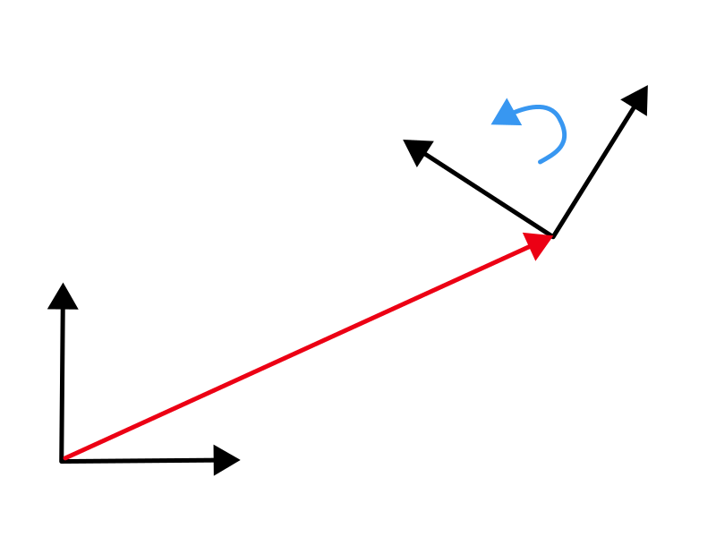

# Transformation matrix

Mathematically A transformation between two coordinate systems \\(A, B\\) can be represented as a matrix in homogenous coordinates:

\\[
\begin{bmatrix}
{}^{A} \vec x \\\\
1
\end{bmatrix}  = {}^{A}_B \mathbf T \\ \begin{bmatrix}
{}^{B} \vec x \\\\
1
\end{bmatrix} \\\\
\begin{bmatrix}
{}^{A} \vec x \\\\
1
\end{bmatrix} = \begin{bmatrix}
{}^{A}_B R & {}^{A}t_B \\\\
0 & 1
\end{bmatrix} \begin{bmatrix}
{}^{B} \vec x \\\\
1
\end{bmatrix}
\\]

The transformation matrix \\( {}^{A}_B T\\) has two core components (Fig. 1):

- a 3x1 displacement vector \\( {}^{A}t_B \\), which describes the translation of \\(B\\)'s origin in the \\(A\\) system. 
  For a sensor mounted at the front center of a 5m long vehicle, the displacement vector to the center of the veicle would be similar to \\( [2.5, 0, 0]^T\\).
- a 3x3 rotation matrix \\({}^{A}_B R\\), which describes the rotation of the axes of coordinate system \\(B\\) in the \\(A\\).
  I.e. the columns are formed from the three unit vectors of B's axes in A: \\({}^{A}\vec X_B\\), \\({}^{A}\vec Y_B\\), and \\({}^{A}\vec Z_B\\).[^ros_transform]

  

<figcaption>

**Figure 1**: Coordinate transformation matrix composed from displacement vector \\( {}^{A}t_B \\) (red) and rotation matrix \\({}^{A}_B R\\) (blue).

</figcaption>

In the next section we will learn how the rotation matrix is composed.

## References

[^ros_transform] ROS Overview - Transformations ([source](http://wiki.ros.org/tf/Overview/Transformations))