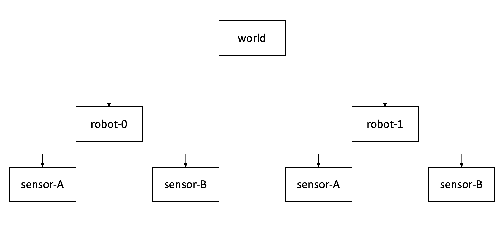

# Transformation tree

## Overview

To transform points between multiple (moving) actors, it is essential to understand the concept of *transformation trees* which define the connections between coordinate systems.

  

<figcaption>

**Figure 1**: Transformation tree for two actors with two sensors each. Each box represents a coordinate system (or frame), each arrow represents the transformation where a parent frame is pointing towards a child frame..

</figcaption>

A *transformation tree* is a directed graph (Fig. 1) with nodes as coordinate systems and transformations between them as vertices. 
In a nutshell, it is helpful to think of the arrows as "mathematical recipes" converting points from one system to another.

The higher level system is often referred to as a **parent frame**, the lower level is often called the **child frame.**.

Note that the structure of this graph remains constant over time, even if the mathematical relation between world and vehicle coordinate systems change.

## Chaining transformations

Having the relations tracked in the tree diagram it is straightforward to **chain** transformations together. The matrix notation allows an computationally efficient transformation between multiple coordinate frames, since we can combine multiple transformations into one matrix (Eq. 2.40 from [^robotics_book]):

\\[
 {}^{A}_C \mathbf T =  {}^{A}_B \mathbf T \\ {}^{B}_C \mathbf T
\\]

Applied to the diagram from Fig. 1 this formulation allows us to transform between *world* and *sensor* coordinate system with a single operation \\(\mathbf T_{world \rightarrow robot0-sensorA}\\).

## References

[^tf_paper] [ROS: *tf* library](http://wiki.ros.org/tf)

[^robotics_book] John Craig, *Introduction to Robotics* (1989)
